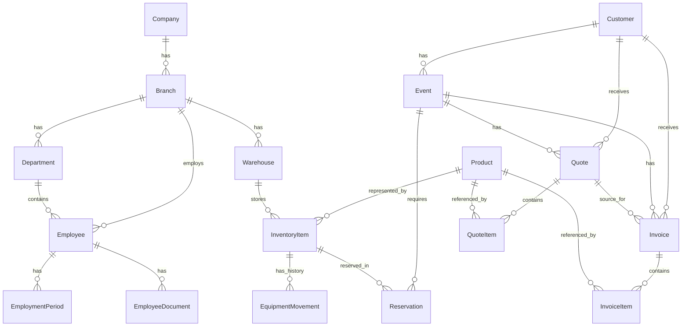

# Nexus Events ERP – Database ERD

## Overview

The Nexus Events ERP backend uses PostgreSQL with Prisma ORM.

The database is organized around the following business areas:

- Organization and branch management
- Employee management
- Customer and event management
- Product and warehouse inventory
- Equipment reservations and movement history
- Quotes and invoices
- Application users and role-based access control

---

## Entity Relationship Diagram



---

## Organization Structure

The organizational hierarchy starts with a company.

```text
Company
└── Branch
    ├── Department
    │   └── Employee
    ├── Employee
    └── Warehouse
        └── InventoryItem
```

### Company

Represents the central company of the ERP system.

A company can have multiple branches.

### Branch

Represents a physical or organizational company branch, for example Hamburg
or Berlin.

A branch belongs to one company and can contain:

- Departments
- Warehouses
- Employees

### Department

Represents a department within a branch.

A department belongs to one branch and can contain multiple employees.

### Warehouse

Represents a physical warehouse belonging to a branch.

A warehouse can store multiple inventory items.

---

## Employee Management

```text
Employee
├── EmploymentPeriod
└── EmployeeDocument
```

An employee belongs to one branch and can optionally belong to one department.

### EmploymentPeriod

Stores employment history.

This allows an employee to leave the company and later be employed again
without deleting the previous employment history.

### EmployeeDocument

Stores metadata for employee-related documents such as:

- Residence permits
- Work permits
- Passports
- Contracts
- Other documents

---

## Customer and Event Management

```text
Customer
└── Event
    └── Reservation
```

### Customer

A customer can be either:

- `COMPANY`
- `PRIVATE`

A customer can have multiple:

- Events
- Quotes
- Invoices

### Event

Represents a customer event or project.

Each event belongs to one customer.

An event can have multiple:

- Equipment reservations
- Quotes
- Invoices

---

## Product and Inventory Management

```text
Product
└── InventoryItem
    ├── Reservation
    └── EquipmentMovement
```

### Product

Represents a product model in the equipment catalog.

Examples include cameras, audio equipment or other event-production
equipment.

Products support the tracking types:

- `SERIALIZED`
- `QUANTITY`

Products support the usage types:

- `RENTAL`
- `SALE`
- `BOTH`

### InventoryItem

Represents an individual physical asset or warehouse item.

Each inventory item belongs to:

- One product
- One warehouse

An inventory item can have:

- Multiple reservations
- Multiple equipment movement records

---

## Equipment Reservations

A reservation connects a specific inventory item with an event for a defined
period.

```text
Event
  │
  └── Reservation ── InventoryItem
```

Reservation statuses:

- `PENDING`
- `CONFIRMED`
- `CANCELLED`
- `COMPLETED`

The application prevents overlapping active reservations for the same
inventory item.

---

## Equipment Movement History

Equipment movements preserve the operational history of individual inventory
items.

```text
InventoryItem
└── EquipmentMovement
```

A movement records information such as:

- Movement type
- Previous status
- New status
- Previous location
- New location
- Notes
- Creation timestamp

This makes equipment status changes traceable without deleting historical
movement information.

---

## Quotes

```text
Customer
└── Quote
    └── QuoteItem
        └── Product (optional)

Event
└── Quote (optional)
```

Each quote belongs to a customer and can optionally reference an event.

A quote contains multiple quote items.

A quote item can optionally reference a product.

Quote statuses:

- `DRAFT`
- `SENT`
- `ACCEPTED`
- `REJECTED`
- `EXPIRED`
- `CANCELLED`

---

## Invoices

```text
Customer
└── Invoice
    └── InvoiceItem
        └── Product (optional)

Event ── Invoice (optional)
Quote ── Invoice (optional)
```

Each invoice belongs to one customer.

An invoice can optionally reference:

- An event
- A quote

An invoice contains multiple invoice items.

Invoice statuses:

- `DRAFT`
- `ISSUED`
- `PAID`
- `OVERDUE`
- `CANCELLED`

---

## Authentication and Authorization

```text
Clerk User
    │
    ▼
AppUser
```

`AppUser` stores the internal application authorization information for an
authenticated Clerk user.

Important fields include:

- `clerkUserId`
- `email`
- `role`
- `isActive`

Authentication is handled by Clerk.

Authorization is handled by the application using the role stored in
PostgreSQL.

`AppUser` is currently independent from the `Employee` entity.

---

## Application Roles

The current role model supports:

- `OWNER`
- `ADMIN`
- `HR_MANAGER`
- `ACCOUNTANT`
- `SALES_MANAGER`
- `PROJECT_MANAGER`
- `DEPARTMENT_MANAGER`
- `WAREHOUSE_MANAGER`
- `TECHNICIAN`
- `WAREHOUSE_EMPLOYEE`
- `SALES_EMPLOYEE`
- `EMPLOYEE`

---

## Database Design Principles

The current database design follows these principles:

1. Business entities use UUID primary keys.
2. Important business numbers such as employee, customer, event, product,
   asset, quote and invoice numbers are unique.
3. Frequently queried foreign keys and status fields are indexed.
4. Operational history such as employment periods and equipment movements is
   stored separately instead of overwriting historical information.
5. Quote items are deleted automatically when their parent quote is deleted.
6. Invoice items are deleted automatically when their parent invoice is
   deleted.
7. Application authentication identities and business employee records are
   currently separated.
